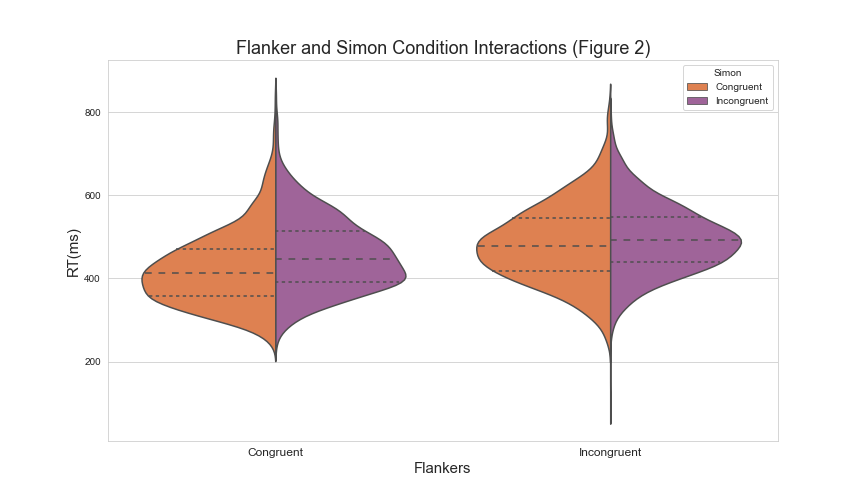
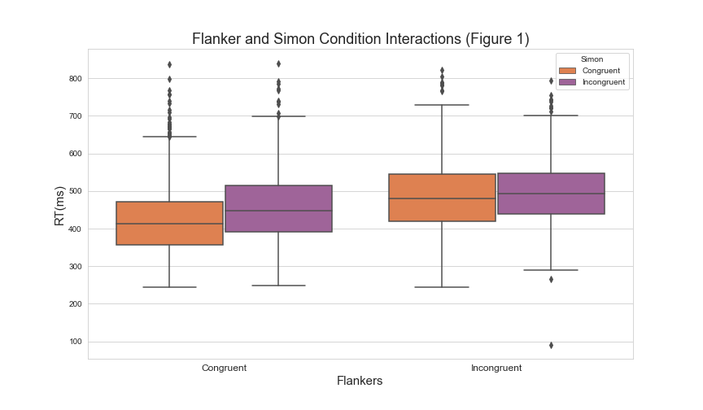

<a href="https://IsaacZacher.github.io/Portfolio/">Home</a>

## Violin Plots 
---

```python
# Violin plot of flankers and Simon conditions
import matplotlib.pyplot as plt
import seaborn as sns
sns.set_style('whitegrid')

fig2 = sns.violinplot(x='flankers', y='rt',  hue='simon',order=["congruent", "incongruent"], data=data,split=True, scale="count", inner="quartile")

fig2.set_title('Flanker and Simon Condition Interactions (Figure 2)', fontsize=18)
fig2.set_xlabel('Flankers', fontsize=15)
fig2.set_ylabel('RT(ms)', fontsize=15)
fig2.set_xticklabels(['Congruent', 'Incongruent'], fontsize=12)
h, l = fig2.get_legend_handles_labels()
labels=['Congruent', 'Incongruent']
fig2.legend(h, labels, title='Simon')

plt.savefig("Violin_plot.png")

```


## Box Plots 
---


```python
import matplotlib.pyplot as plt
import seaborn as sns

sns.set_style('whitegrid')

fig1 = sns.boxplot(x='flankers', y='rt', hue='simon', order=["congruent", "incongruent"], data=data)

fig1.set_title('Flanker and Simon Condition Interactions (Figure 1)', fontsize=18)
fig1.set_xlabel('Flankers', fontsize=15)
fig1.set_ylabel('RT(ms)', fontsize=15)
fig1.set_xticklabels(['Congruent', 'Incongruent'], fontsize=12)
plt.legend(title='Simon', labels=['Congruent', 'Incongruent'])
h, l = fig1.get_legend_handles_labels()
labels=['Congruent', 'Incongruent']
fig1.legend(h, labels, title='Simon')

plt.savefig("Boxplot.png")
```
> *Code developed with Sarah Harrison 




## Heat Map 
```python
by_cross = data.groupby('weekday hour'.split()).apply(count_rows).unstack()
by_cross.head(20)

```


<table border="1" class="dataframe">
  <thead>
    <tr style="text-align: right;">
      <th>hour</th>
      <th>0</th>
      <th>1</th>
      <th>2</th>
      <th>3</th>
      <th>4</th>
      <th>5</th>
      <th>6</th>
      <th>7</th>
      <th>8</th>
      <th>9</th>
      <th>...</th>
      <th>14</th>
      <th>15</th>
      <th>16</th>
      <th>17</th>
      <th>18</th>
      <th>19</th>
      <th>20</th>
      <th>21</th>
      <th>22</th>
      <th>23</th>
    </tr>
    <tr>
      <th>weekday</th>
      <th></th>
      <th></th>
      <th></th>
      <th></th>
      <th></th>
      <th></th>
      <th></th>
      <th></th>
      <th></th>
      <th></th>
      <th></th>
      <th></th>
      <th></th>
      <th></th>
      <th></th>
      <th></th>
      <th></th>
      <th></th>
      <th></th>
      <th></th>
      <th></th>
    </tr>
  </thead>
  <tbody>
    <tr>
      <th>0</th>
      <td>518</td>
      <td>261</td>
      <td>238</td>
      <td>571</td>
      <td>1021</td>
      <td>1619</td>
      <td>2974</td>
      <td>3888</td>
      <td>3138</td>
      <td>2211</td>
      <td>...</td>
      <td>3117</td>
      <td>3818</td>
      <td>4962</td>
      <td>5574</td>
      <td>4725</td>
      <td>4386</td>
      <td>3573</td>
      <td>3079</td>
      <td>1976</td>
      <td>1091</td>
    </tr>
    <tr>
      <th>1</th>
      <td>765</td>
      <td>367</td>
      <td>304</td>
      <td>516</td>
      <td>887</td>
      <td>1734</td>
      <td>3766</td>
      <td>5304</td>
      <td>4594</td>
      <td>2962</td>
      <td>...</td>
      <td>4489</td>
      <td>6042</td>
      <td>7521</td>
      <td>8297</td>
      <td>7089</td>
      <td>6459</td>
      <td>6310</td>
      <td>5993</td>
      <td>3614</td>
      <td>1948</td>
    </tr>
    <tr>
      <th>2</th>
      <td>899</td>
      <td>507</td>
      <td>371</td>
      <td>585</td>
      <td>1003</td>
      <td>1990</td>
      <td>4230</td>
      <td>5647</td>
      <td>5242</td>
      <td>3846</td>
      <td>...</td>
      <td>5438</td>
      <td>7071</td>
      <td>8213</td>
      <td>9151</td>
      <td>8334</td>
      <td>7794</td>
      <td>7783</td>
      <td>6921</td>
      <td>4845</td>
      <td>2571</td>
    </tr>
    <tr>
      <th>3</th>
      <td>792</td>
      <td>459</td>
      <td>342</td>
      <td>567</td>
      <td>861</td>
      <td>1454</td>
      <td>3179</td>
      <td>4159</td>
      <td>3616</td>
      <td>2654</td>
      <td>...</td>
      <td>4083</td>
      <td>5182</td>
      <td>6149</td>
      <td>6951</td>
      <td>6637</td>
      <td>5929</td>
      <td>6345</td>
      <td>6585</td>
      <td>5370</td>
      <td>2909</td>
    </tr>
    <tr>
      <th>4</th>
      <td>1367</td>
      <td>760</td>
      <td>513</td>
      <td>736</td>
      <td>932</td>
      <td>1382</td>
      <td>2836</td>
      <td>3943</td>
      <td>3648</td>
      <td>2732</td>
      <td>...</td>
      <td>4087</td>
      <td>5354</td>
      <td>6259</td>
      <td>6790</td>
      <td>7258</td>
      <td>6247</td>
      <td>5165</td>
      <td>6265</td>
      <td>6708</td>
      <td>5393</td>
    </tr>
    <tr>
      <th>5</th>
      <td>3027</td>
      <td>2479</td>
      <td>1577</td>
      <td>1013</td>
      <td>706</td>
      <td>704</td>
      <td>844</td>
      <td>1110</td>
      <td>1372</td>
      <td>1764</td>
      <td>...</td>
      <td>3042</td>
      <td>4457</td>
      <td>5410</td>
      <td>5558</td>
      <td>6165</td>
      <td>5529</td>
      <td>4792</td>
      <td>5811</td>
      <td>6493</td>
      <td>5719</td>
    </tr>
    <tr>
      <th>6</th>
      <td>4542</td>
      <td>2936</td>
      <td>1590</td>
      <td>1052</td>
      <td>685</td>
      <td>593</td>
      <td>669</td>
      <td>873</td>
      <td>1233</td>
      <td>1770</td>
      <td>...</td>
      <td>2934</td>
      <td>3400</td>
      <td>3489</td>
      <td>3154</td>
      <td>2795</td>
      <td>2579</td>
      <td>2276</td>
      <td>2310</td>
      <td>1639</td>
      <td>1018</td>
    </tr>
  </tbody>
</table>
<p>7 rows × 24 columns</p>
</div>


```python
sns.heatmap(by_cross)
plt.show()
```
<a href="https://isaaczacher.github.io/Portfolio/Figure_Examples.html">Back to Top </a>
